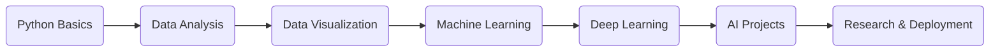
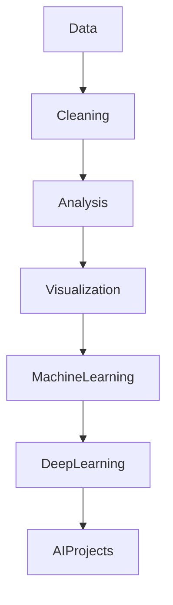

# 🐍 Learning Python, Machine Learning & Data Science


---

# 📚 Overview

This repository documents my journey in **Python**, **Data Science**, **Machine Learning**, and **AI Development** through structured learning, practical projects, experiments, notebooks, and research implementations.

The goal of this repository is to create a beginner-friendly open-source learning space where developers, students, and AI enthusiasts can:

- Learn Python fundamentals
- Understand Data Science workflows
- Explore Machine Learning algorithms
- Build Deep Learning models
- Work on real-world AI projects
- Practice data analysis and visualization
- Contribute to open-source learning resources

---

# 🎯 Learning Objectives

By contributing to or exploring this repository, learners will:

- Master Python programming fundamentals
- Learn data manipulation using Pandas & NumPy
- Perform Exploratory Data Analysis (EDA)
- Understand Machine Learning concepts
- Build ML models using Scikit-learn
- Explore Deep Learning with TensorFlow & PyTorch
- Visualize datasets effectively
- Work with Jupyter Notebooks
- Develop practical AI/Data Science projects

---

# 🛠️ Tech Stack

## Languages & Libraries

- Python
- Pandas
- NumPy
- Scikit-learn
- TensorFlow
- PyTorch
- Matplotlib
- Jupyter Notebook

---

# 🧠 Learning Roadmap



---

# 🏗️ Repository Structure

```bash
learning-python_machine-learning_data-science/
│
├── Python/
├── Data-Science/
├── Machine-Learning/
├── Deep-Learning/
├── Projects/
├── Research/
├── Datasets/
├── Notebooks/
└── README.md
```

---

# 🚀 Setup Instructions

## 1️⃣ Clone the Repository

```bash
git clone https://github.com/CH-CHISAKA/learning-python_machine-learning_data-science.git
```

## 2️⃣ Navigate to Project Directory

```bash
cd learning-python_machine-learning_data-science
```

## 3️⃣ Create Virtual Environment

### Windows

```bash
python -m venv venv
venv\Scripts\activate
```

### Linux / macOS

```bash
python3 -m venv venv
source venv/bin/activate
```

---

## 4️⃣ Install Dependencies

```bash
pip install -r requirements.txt
```

---

## 5️⃣ Launch Jupyter Notebook

```bash
jupyter notebook
```

---

# 📖 Learning Path

## Beginner Level

- Python Basics
- Variables & Data Types
- Functions & Loops
- Object-Oriented Programming

## Intermediate Level

- NumPy
- Pandas
- Data Cleaning
- Data Visualization

## Advanced Level

- Machine Learning Algorithms
- Model Evaluation
- Feature Engineering
- Deep Learning

## Expert Level

- AI Research
- Neural Networks
- Real-world Projects
- Deployment & Optimization

---

# 📊 Architecture / Workflow



---

# 🤝 Contribution Guide

Contributions are welcome!

## Steps to Contribute

1. Fork the repository
2. Clone your fork
3. Create a new branch
4. Make your changes
5. Commit your work
6. Push your branch
7. Open a Pull Request

---

# 🌱 Branch Naming Convention

Use meaningful branch names:

```bash
feature/add-linear-regression
feature/python-notes
fix/notebook-error
docs/update-readme
refactor/data-cleaning
```

---

# 📝 Commit Message Convention

Use clean and consistent commit messages:

```bash
feat: add logistic regression notebook
fix: resolve dataset loading issue
docs: improve README structure
refactor: optimize preprocessing pipeline
```

---

# 🛣️ Future Roadmap

- [ ] Add beginner Python tutorials
- [ ] Add advanced ML algorithms
- [ ] Add NLP projects
- [ ] Add Computer Vision projects
- [ ] Add Generative AI implementations
- [ ] Add MLOps workflows
- [ ] Add deployment tutorials
- [ ] Add Kaggle competition solutions
- [ ] Add Docker support
- [ ] Add CI/CD pipelines

---

# 🌍 Open Source Vision

This repository aims to become a collaborative learning hub for:

- Students
- Developers
- Researchers
- AI Enthusiasts
- Open-source Contributors

The focus is on practical learning, experimentation, and community-driven growth.

---

# 📌 Additional Notes

- Beginner friendly
- Open-source focused
- Structured learning roadmap
- Real-world projects
- Continuous updates
- Community contributions encouraged

---

# ⭐ Support

If you find this repository helpful:

- Star the repository
- Fork it
- Contribute to it
- Share it with learners

---

# 📄 License

This project is open-source and available under the MIT License.